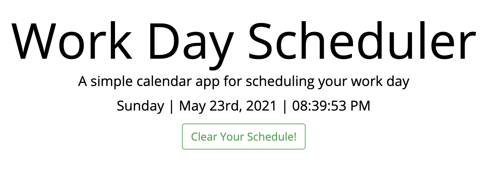
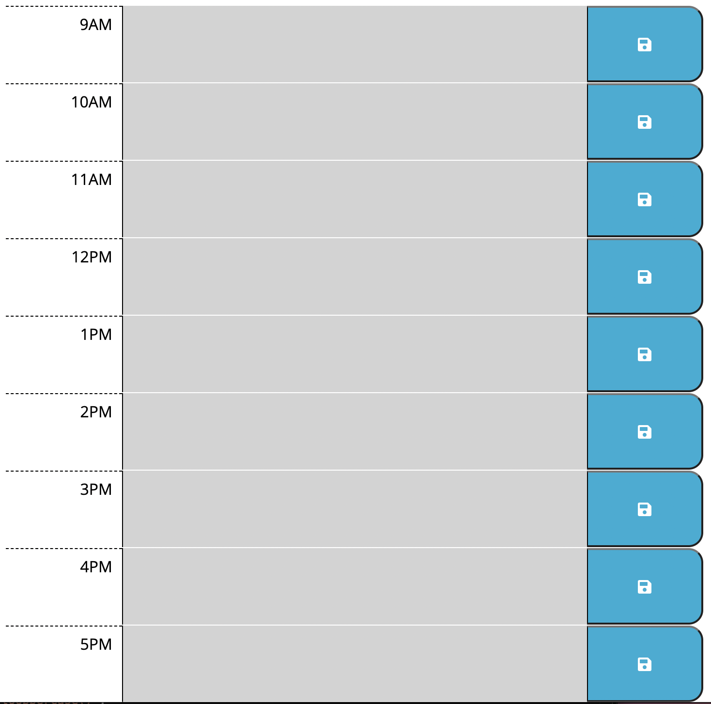
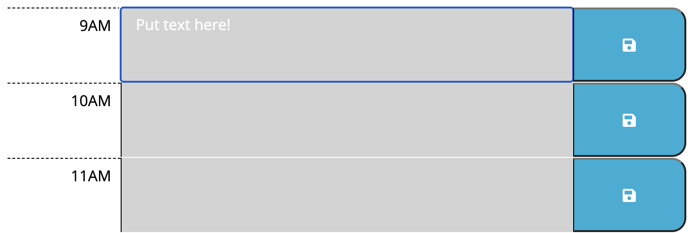
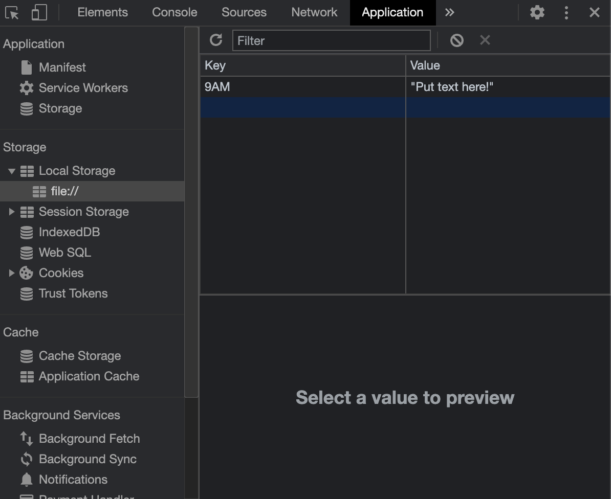
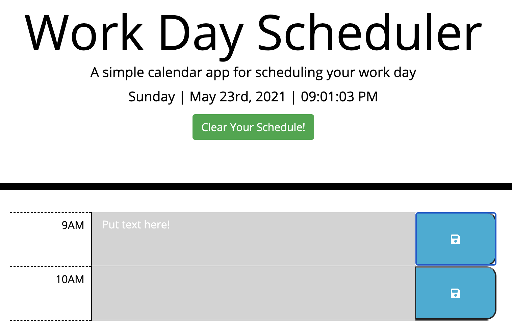
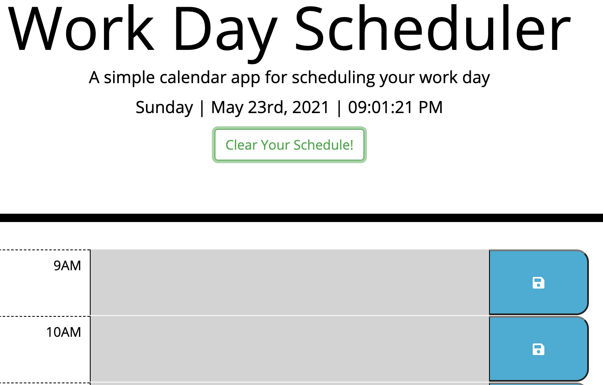
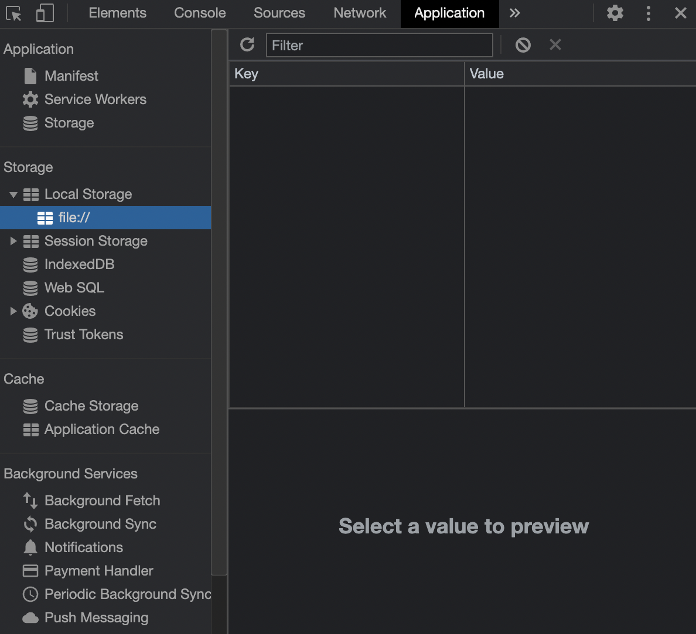

# Work Day Scheduler

This site will help you schedule and organize your day!
You can input activities for each hour and save them for later through your Local Storage.

Follow this link to check it out:
[Password Generator](https://abergtra.github.io/challenge-05/)

## User Interface

The page heading provides today's date and constantly updating time:



The page's body lists work hours, a text area and save button as shown:



The text area format updates depending if the time slot is in the past, present, or future:

```bash
- Past: text area is gray as shown above
- Present: text area is red
- Future: text area is green
```

If you plan to work overtime, extra sections can be added for your convenience. just let Asher know!

## User Interaction

The user can input their To-Do activities in the text areas provided and press the save button.



When the user presses the save button, the text is saved locally:



Try refreshing the page! The to do activities will stay there!
When you complete all your tasks press clear schedule in the heading:



Now your schedule is cleared:



Check the local storage! It is empty and ready for new activities!



Good luck and be productive!

## Author

Asher Bergtraun